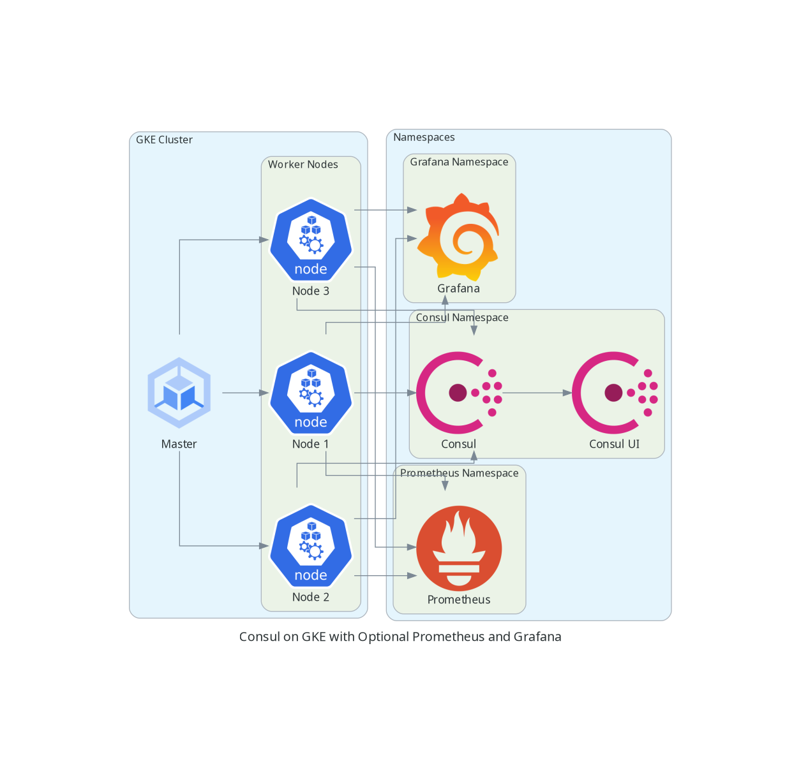

# Consul on GKE Module

This opinionated module deploys HashiCorp's Consul service mesh on GKE. It will likely work on AKS/EKS and possibly OpenShift as well, but it has been tested for GKE. Also bundled are optional capabilities to deploy Prometheus and Grafana complete with a pre-configured Prometheus Datasource and Consul Dashboard for Grafana. 

